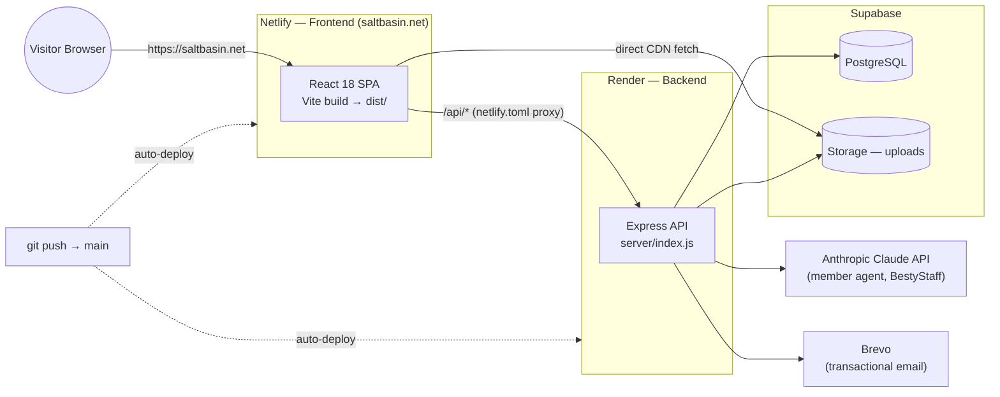
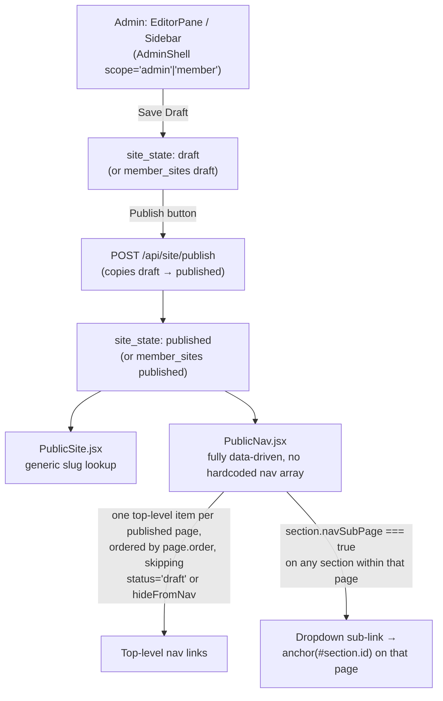

# Salt Basin Net Works Platform — Technical Design Specification

**Version:** 1.1 · **Date:** 2026-07-06 · **Scope:** Full platform as built

**Companion documents:** [FUNCTIONAL_DESIGN_SPEC.md](FUNCTIONAL_DESIGN_SPEC.md) · [FUNCTIONAL_TECHNICAL_MAPPING.md](FUNCTIONAL_TECHNICAL_MAPPING.md) · [CHANGELOG.md](CHANGELOG.md)

---

## 1. Architecture Overview

### 1.1 System / Deployment Diagram



Both Netlify and Render auto-deploy from the `main` branch on every push — see `DEPLOY.md`. There is no separate manual "deploy" step beyond committing and pushing; content edits (draft → publish) are a distinct, code-independent action described in 1.2 below.

### 1.2 Draft → Publish → Public Content Flow



As of 2026-07-06, `PublicNav.jsx` has no hardcoded nav structure. Adding a page automatically adds a top-level nav item; checking "Show as a sub-page link in the nav" on any section (in EditorPane's Section Settings) automatically adds that section as a dropdown link under its parent page, anchored to `section.id`. See §2.3 and §2.6 for the section/registry detail.

### 1.3 Stack & Runtime

**Stack:** React 18 + Vite (frontend, no TypeScript, ESM throughout) · Express.js (backend) · PostgreSQL via Supabase (`postgres` npm package wrapped in a `node:sqlite`-shaped adapter) · Supabase Storage (file uploads) · Anthropic Claude API (agents) · Brevo (transactional email, stdout-stub fallback).

**Processes:** `npm run dev` runs Vite (5173) and Express (3001) concurrently in development; `npm start` serves the Vite production build as static assets from the same Express process that serves the API in production.

**Routing (`src/App.jsx`):**

| Path | Component | Notes |
|---|---|---|
| `/login`, `/admin/login` | `LoginPage` | Same component; `/admin/login` is a back-compat alias |
| `/reset/:token` | `ResetPasswordPage` | |
| `/signup` | `SignupPage` | |
| `/member` | `MemberDashboard` | Renders `AdminShell` with `scope='member'` |
| `/u/:slug`, `/u/:slug/*` | `PublicProfile` | Public member site |
| `/lead/:publicId` | `LeadView` | Lead self-service view |
| `/data-notice` | `DataNotice` | |
| `/output/*` (11 routes) | `Output.jsx` exports | Print-isolated, unauthed-reachable documents |
| `/admin/*` | `AdminShell` (scope='admin') | Wrapped in `RequireAdmin` |
| `/*` | `PublicRoute` → `LandingGate` or `PublicSite` | Canonical Salt Basin site, optionally prelaunch-gated |

**Database adapter (`server/db.js`, ~1636 lines):** Wraps the async `postgres` package to mimic the synchronous-feeling `node:sqlite` API:

```js
await db.prepare(sql).get(...params)   // first row or null
await db.prepare(sql).all(...params)   // array
await db.prepare(sql).run(...params)   // { lastInsertRowid, changes }
await db.exec(sql)                     // raw exec, no params
db.raw                                  // direct tagged-template postgres client
```

Critical constraint: `postgres` rejects `undefined` parameters — every optional value must be passed as `null`. All timestamps are `BIGINT` milliseconds (`Date.now()`), not native SQL timestamp types. Schema evolves via idempotent `CREATE TABLE IF NOT EXISTS` / `ALTER TABLE ... ADD COLUMN IF NOT EXISTS` statements run on every boot inside `bootstrap()`.

**Server-side route inventory (`server/routes/*.js`):** agent, analytics, auth, backlog, config, events, fieldAudit, finbridgeco, globalStandards, governance, herq, jira, leads, lineage, memberAgent, memberConfig, members, memberSite, memberTemplates, nrm, oauth, outputTemplates, profiles, qa, resumeAccess, services, site, uploads.

**Shared libraries (`server/lib/*.js`):** audit, crypto, email, lineage, molecule, oauthProviders, rateLimit, recaptcha, snapshot, trajectory, vectorize.

---

## 2. Core CMS & Draft/Publish — Technical Detail

### 2.1 Data Model

**`site_state`** (admin canonical site)
| Column | Type | Notes |
|---|---|---|
| `id` | TEXT PK | `'draft'` or `'published'` |
| `data` | TEXT | JSON: `{ pages: { [slug]: { key, name, slug, type, status, order, navLabel, navGroup, hideFromNav, sections: [{ id, type, name, status, bg, fields, fieldMeta, navSubPage, navLabel }] } } }` |
| `updated_at` | BIGINT | |

**`config_state`** — same shape, `id ∈ {'draft','published','admin_nav'}`. The `'admin_nav'` row holds `{ views: [{ id, label, sortOrder, tabs: [{ id, label, componentId, sortOrder }] }] }` — this drives the internal admin console's own top nav (My Profile / Platform Lifecycle Management / etc.), a separate concern from the public-facing site nav below.

**Public site nav (`section.navSubPage`, added 2026-07-06):** the visitor-facing nav (`PublicNav.jsx`) is generated at render time, not stored separately — one top-level item per published page (ordered by `page.order`), with a dropdown built from that page's sections where `section.navSubPage === true`, linking to `#section.id` on that page. `page.navGroup` (grouping several *pages* under one dropdown) remains supported for member sites only, where each member's page count is open-ended; the admin/platform site collapses everything to one page per nav item plus in-page `navSubPage` anchors instead.

**`member_sites`** / **`member_configs`** — multi-tenant equivalents, composite PK `(user_id, kind)`, `kind ∈ {'draft','published'}` (CHECK constraint), same JSON shapes.

**`member_profiles`** — `user_id` PK, `slug` UNIQUE, legacy `draft`/`published` TEXT columns (superseded by `member_sites`), `created_at`/`updated_at`.

**`field_audit_log`** — `id`, `user_id`, `section_id`, `field_key`, `before_value`, `after_value`, `created_at`. Indexes: `(section_id, created_at)`, `(user_id, created_at)`.

**`field_lineage`** / **`data_snapshots`** — see §9 (Lineage).

### 2.2 API Surface

| Method | Path | Auth | Purpose |
|---|---|---|---|
| GET | `/api/site/published` | landing-gate check | Public-filtered site (`publicView()` strips draft pages/sections) |
| GET | `/api/site/draft` | admin | Full draft including draft-status sections |
| PUT | `/api/site/draft` | admin | Body `{ pages }`; validates typeof object; captures lineage |
| POST | `/api/site/publish` | admin | Copies draft → published (site + config); 409 if draft has no pages |
| GET | `/api/config/public` | landing-gate check | Sanitized published config (`site`, `social`, `brand`, `bestystaff` only) |
| GET/PUT | `/api/config/draft` | admin | |
| GET/PUT | `/api/config/admin-nav` | admin | Validates unique view IDs and globally-unique tab IDs |
| POST | `/api/config/test-email` | admin | Sends via Brevo or stdout-stubs |
| GET/PUT | `/api/member-site/draft` | member (self) | Auto-seeds `defaultMemberSite()` on first access |
| POST | `/api/member-site/publish` | member (self) | 404 if no draft; 400 if draft has no pages |
| GET | `/api/member-site/featured` | public | Members with `config.featured.displayOnHome=true` |
| GET | `/api/member-site/by-slug/:slug` | public | Joins `member_profiles → member_sites(published) → member_configs(published)`; logs `page_events` |
| GET/PUT | `/api/member-config/draft` | member (self) | Defensive merge preserves `integrations` if omitted from PUT body |
| POST | `/api/member-config/publish` | member (self) | |

### 2.3 Block Registry (`src/components/blocks/index.jsx`, ~5,207 lines)

`REGISTRY` maps `section.type → Component`; `RenderSection({ section, config, mode, memberSlug, liveSlugs })` dispatches. `mode='public'|'preview'` gates the `StatusBanner`. `liveSlugs` (a `Set` or `null`) drives `isLiveHref()` — in preview, always true; in public, only true for slugs that are actually published (plus universal allow-list: anchors, external URLs, `/output/*`, `/u/*`, `/member*`, `/admin*`, `/lead/*`, `/login*`, `/signup*`, `/reset/*`, `/data-notice*`).

Registered block types (37): `hero`, `scripture`, `about`, `cards`, `twoCol`, `resume`, `socialGrid`, `contact`, `text`, `cta`, `industries`, `domains`, `services`, `assessments`, `joinNetwork`, `referencesRequest`, `forCompanies`, `industryWheel`, `domainsNiche`, `technology`, `aboutIntro`, `execDashboard`, `timeline`, `caseStudies`, `netWorksBanner`, `statGrid`, `process`, `columns`, `iconGrid`, `kpiDashboard`, `roadmap`, `heatmap`, `leaderboard`, `executiveSummary`, `appMockup`, `choiceGrid`, `decisionTree`, `outputGenerator`, `skills`, `clientSnapshot`. Several (`cards`, `resume`, `domains`) support both a legacy fixed-slot field format (`card1Title`, `card1Desc`, ...) and a newer array format (`cards: [{title,desc,icon}]`); the editor hides legacy fields once the array is populated.

**`domainsNiche` and `execDashboard` (added 2026-07-06):** split out of the original monolithic `industryWheel` and `about` components to let Betsy's Home page pair different content side-by-side without duplicating layout code — `industryWheel` now renders only the wheel + tech-capability panel (paired with the founder card), while `domainsNiche` renders the categorized-domains + niche-solutions panels on their own Consulting page, and `execDashboard` renders a stat-tile + highlight-card dashboard (paired with the Salt Basin Mission card, reusing the same translucent-card-on-navy treatment as `aboutIntro`).

**`ExpandableTile` (shared helper, same file):** a dashboard-tile pattern used by `TimelineBlock`'s per-job bullets and `CaseStudiesBlock`'s `CaseField` — clamps text to 3 lines by default (`-webkit-line-clamp`), then shows the full text in a raised overlay on hover (desktop) or tap (touch, via the same `onClick` handler), so dense resume-style copy reads as a scannable grid instead of a wall of paragraphs without deleting any of the underlying text.

### 2.4 Field Metadata System (`src/data/capabilityTags.js`)

Per-field `fieldMeta` shape:
```js
{
  sourceType: 'user_input' | 'merged' | 'derived' | 'direct',
  mergedFrom?: 'users.display_name' | 'config.site.ownerName',
  sources?: [{ sourceKind: 'merged'|'external', system, capabilityTag, description }],
  visible?: bool, auditable?: bool,
  fieldType?: 'text'|'textarea'|'number'|'date'|'boolean'|'select'|'multiselect'|'url'|'email'|'json'|'image'|'color'|'richtext',
  valueSet?: [{value,label}], multiSelect?: bool,
  cascades?: [{ triggerField, triggerValue, filterValues }],
}
```
`MERGED_FIELD_DEFAULTS` auto-wires `hero.heading → users.display_name`, `hero.ownerName → config.site.ownerName`, `contact.email → users.email`. `TAG_CATEGORIES` defines 8 categories / 70+ capability tags (revenue_operations, financial_intelligence, saas_metrics, fund_operations, operational_risk, governance, systems_integration, operator_profile) used to classify `derived` fields sourced from a member's connected systems.

### 2.5 Notable Patterns

- **Authorization helper:** `async function requireAuth(req,res){ const user = await getUserFromCookie(req); if(!user){res.status(401)...; return null;} return user; }` — every handler must `await`; a missed `await` produces a `Promise` treated as a user object → `postgres UNDEFINED_VALUE`.
- **Public view filtering:** `publicView(site)` strips `pages[k]` where `pg.status==='draft'` and filters each page's `sections` to `s.status !== 'draft'` — enforced server-side, not client-side.
- **Hook ordering:** all `useState`/`useMemo`/`useEffect` in `EditorPane.jsx` must precede any early `return` — a prior blank-screen bug came from violating this.
- **Immutable draft updates:** `patchDraft(updater) { setDraft(d => updater(JSON.parse(JSON.stringify(d)))); }` — deep clone before mutation.

---

## 3. Authentication, Security & Identity

### 3.1 Data Model

| Table | Key Columns | Notes |
|---|---|---|
| `users` | id, email (UNIQUE), password_hash (bcrypt, 10 rounds), role, display_name, created_at | |
| `sessions` | token PK (48-hex), user_id FK CASCADE, expires_at, created_at | 14-day TTL; idx on user_id |
| `password_reset_tokens` | token PK (64-hex), user_id, expires_at (1hr), used_at | Single-use |
| `landing_sessions` | token PK, expires_at (7d) | Prelaunch password gate |
| `personal_profiles` | user_id UNIQUE FK, display_name, bio, avatar_url, location, pronouns, metadata JSONB | 1:1 with users |
| `organization_profiles` | id, slug UNIQUE, name, org_type, description, logo_url, website, industry, metadata JSONB | |
| `org_memberships` | user_id, org_id, role (owner/admin/member/viewer), invited_by, joined_at | UNIQUE(user_id, org_id) |
| `personal_org_links` | personal_profile_id, org_id, linked_at | Composite PK |
| `user_emails` | id, user_id, email UNIQUE, type (personal/work), verified, verification_code, code_expires_at (15min) | |
| `product_licenses` | id, user_id, org_id (nullable), product_id, tier, granted_by, granted_at, expires_at, is_active | Soft-delete via is_active |
| `data_entitlements` | id, license_id FK, scope JSONB `{capabilities[],providers[],maxRows,allowExport}` | |
| `audit_log` | id, actor_id, actor_email, actor_role, action, entity_type, entity_id, summary, diff, ip, user_agent, created_at | Platform-wide |
| `member_connections` | id, requester_id, recipient_id, status (pending/accepted/declined), message | UNIQUE(requester_id, recipient_id) |
| `member_messages` | id, sender_id, recipient_id, body (≤5000c), read_at, created_at | |

### 3.2 API Surface

| Method | Path | Auth | Notes |
|---|---|---|---|
| POST | `/api/auth/login` | rate-limited (10/15min/IP) | Tries bcrypt.compare against `users` then verified `user_emails`; 401 generic on failure; audit `auth.login`/`auth.login.failed` |
| POST | `/api/auth/logout` | any | Idempotent; deletes session row, clears cookie |
| GET | `/api/auth/me` | any | `{ user }` or `{ user: null }` |
| POST | `/api/auth/change-password` | admin session | bcrypt.compare current, then re-hash |
| POST | `/api/auth/reset-request` | rate-limited, reCAPTCHA action `forgot_password` | Always 200; token only issued/emailed if match found |
| POST | `/api/auth/reset-confirm` | token | Validates not-expired/not-used; hashes new password; marks all other unused tokens for that user used; **deletes all sessions for user** |
| POST | `/api/auth/email-recover` | rate-limited, reCAPTCHA action `forgot_email` | Looks up `leads.phone → converted_user_id`; always 200 |
| GET/POST | `/api/auth/landing-gate/*` | none / password | `sb_landing` cookie, 7-day |
| POST | `/api/members/signup` | reCAPTCHA action `signup` | `createMember()`; auto-slug; auto-login |
| GET/POST/DELETE | `/api/members/me/emails*` | requireUser | 6-digit code, 15-min expiry; primary email undeletable |
| GET/PATCH | `/api/profiles/me/personal` | requireAuth | Auto-creates on first read; UPSERT with COALESCE on PATCH |
| GET/POST | `/api/profiles/me/orgs` | requireAuth | Slug auto-generated + collision-looped |
| GET/PATCH/DELETE | `/api/profiles/orgs/:orgId` | requireAuth (role-gated) | owner/admin only for PATCH; owner-only DELETE |
| POST/PATCH/DELETE | `/api/profiles/orgs/:orgId/members*` | requireAuth (role-gated) | Invite always returns 200 even if email unmatched (enumeration defense) |
| POST/DELETE | `/api/profiles/me/personal/link-org/:orgId` | requireAuth | ON CONFLICT DO NOTHING |
| GET | `/api/profiles/me/licenses` | requireAuth | Active + non-expired only |
| GET/POST/DELETE | `/api/profiles/admin/*` | requireAdmin | Org/license admin views; DELETE = soft (is_active=false) |
| GET | `/api/members/me/audit`, `/me/stats` | requireUser | Own data only |
| GET | `/api/members/admin/audit`, `/admin/stats` | requireAdmin | Platform-wide |
| POST/GET | `/api/members/me/connections*`, `/me/messages*` | requireUser | Messaging requires an `accepted` connection first |
| POST/GET | `/api/field-audit` | requireAuth | `{sectionId, fieldKey, before, after}` |

### 3.3 Security Mechanisms

- **Cookie `sb_admin`:** httpOnly, sameSite=lax, secure in production, 14-day maxAge, path `/`.
- **Session validation (critical async pattern):**
  ```js
  export async function getUserFromCookie(req) {
    const token = req.cookies?.[ADMIN_COOKIE];
    if (!token) return null;
    const row = await db.prepare(`SELECT u.id,u.email,u.role,u.display_name,s.expires_at
      FROM sessions s JOIN users u ON u.id=s.user_id WHERE s.token=$1`).get(token);
    if (!row) return null;
    if (Number(row.expires_at) < Date.now()) { await destroySession(token); return null; }
    maybePurgeExpiredSessions();
    return { id: Number(row.id), email: row.email, role: row.role, displayName: row.display_name };
  }
  ```
  Every caller **must** `await` this — forgetting produces a Promise treated as a truthy user object downstream.
- **Password hashing:** bcrypt, 10 salt rounds, used at signup, login-compare, change-password, and reset-confirm.
- **Rate limiting:** in-process `Map`, 15-minute window, 10 attempts/IP, applied to `/login`, `/reset-request`, `/email-recover`; 429 with `Retry-After` header.
- **reCAPTCHA v3:** min score 0.5 (env-tunable); no-op fallback (`{ok:true, skipped:true}`) if `RECAPTCHA_SECRET_KEY` unset, with a one-time console warning.
- **Audit logging:** `audit()` in `server/lib/audit.js` wraps writes in try/catch — a failed audit write never blocks the primary operation, only logs `console.warn`.
- **Session GC:** `maybePurgeExpiredSessions()` fires probabilistically (~0.5% of calls, capped at once/minute) rather than on a cron.
- **Email enumeration defense:** reset-request, email-recover, and org-member-invite all return identical success responses regardless of match.

---

## 4. OAuth & Third-Party Integrations

### 4.1 Data Model

**`member_oauth_connections`** (legacy, actively used): `id`, `user_id` FK CASCADE, `provider`, `external_id`, `label`, `access_token_enc`, `refresh_token_enc`, `token_expires_at`, `scopes`, `metadata` JSONB, `allow_write` (bool, default false), `created_at`, `updated_at`. UNIQUE `(user_id, provider)`.

**`oauth_connections`** (new, schema-ready, not yet wired into routes): adds `profile_scope` (`'personal'|'org'`) and `profile_id`, UNIQUE `(profile_scope, profile_id, provider)` — supports future org-scoped (not just user-scoped) integrations.

### 4.2 Provider Catalog (`server/lib/oauthProviders.js`, 14 providers)

| Provider | Grant | Tenant URL req'd | Key metadata |
|---|---|---|---|
| Microsoft | auth_code | No | instanceUrl (opt) |
| Salesforce | auth_code | Dynamic (from token resp) | instanceUrl |
| QuickBooks | auth_code | No | realmId (from callback query) |
| LinkedIn | auth_code | No | — |
| Supabase | auth_code + PAT fallback | No | projectRef |
| Workday | auth_code | Yes | tenantUrl, tenantId |
| Snowflake | auth_code or client_credentials | Yes (accountId) | accountId |
| Tableau | auth_code | Yes | tenantUrl, siteName |
| Zuora | client_credentials | No | — |
| DealHub | auth_code | No | — |
| Marketo | client_credentials | Yes (munchkinId) | munchkinId |
| HubSpot | auth_code | No | — (identity via token introspection) |
| SAP | auth_code | Yes | tenantUrl, subdomain |
| Oracle | auth_code | Yes | tenantUrl |

Each provider config object exposes `authUrl`/`tokenUrl` (static or dynamically built), `scopes`, `clientId()`/`clientSecret()` (lazy env lookups), `redirectUri()`, and an overridable `fetchIdentity(token, extra)`.

### 4.3 API Surface

| Method | Path | Auth | Notes |
|---|---|---|---|
| GET | `/api/oauth/:provider/connect` | requireAuth | Client-credentials providers connect immediately server-side; others generate 24-byte hex `state`, store in an in-memory `pendingStates` Map (10-min TTL), redirect to provider |
| GET | `/api/oauth/:provider/callback` | none (provider redirect) | Validates state, exchanges code, fetches identity, encrypts tokens, `ON CONFLICT (user_id,provider) DO UPDATE` upsert |
| POST | `/api/oauth/supabase/pat` | requireAuth | Verifies PAT against `GET https://api.supabase.com/v1/profile` before storing |
| GET | `/api/oauth/connections` | requireAuth | Returns connected + available provider lists; never returns raw tokens |
| PATCH/DELETE | `/api/oauth/connections/:provider` | requireAuth | Toggle `allow_write`; hard delete on disconnect (no provider-side revocation call) |
| — | `getLiveToken(userId, providerId)` (internal export) | — | Returns `{token, metadata}` or `null`; refreshes if `token_expires_at` is within 60s or already past, using `refresh_token_enc` if present |

### 4.4 Security Mechanisms

- **Token encryption:** AES-256-GCM, `TOKEN_ENCRYPTION_KEY` (64 hex chars / 32 bytes) from env, random 12-byte IV per encryption, stored as `iv:authTag:ciphertext` (hex, colon-delimited).
- **CSRF/state:** ephemeral in-memory `Map<state, {userId, providerId, extra, createdAt}>`, pruned of entries older than 10 minutes on every `/connect` call. Single-process only — does not survive restarts or scale across instances (acceptable given the ~30s OAuth window).
- **Refresh with buffer:** `getLiveToken` treats a token as valid if `token_expires_at > Date.now() + 60_000`; otherwise attempts refresh; refresh failures are logged and return `null` rather than throwing.

### 4.5 Jira Integration (Distinct — HTTP Basic Auth, not OAuth)

`jira_config` table stores `base_url`, `email`, `api_token` (currently plaintext TEXT — flagged as tech debt, should use `crypto.js` like OAuth tokens). `server/routes/jira.js` provides config/test/import endpoints; import maps JQL results into `backlog_items` with `jira_issue_key` for future delta sync.

---

## 5. Member & Public Sites, Lead Flow, Outputs

### 5.1 Data Model

| Table | Key Columns |
|---|---|
| `leads` | id, source, email, phone, name, message, public_id UNIQUE, access_token (legacy), password_hash (bcrypt), answers (JSON), prior_notes (JSON array), merged_into_id, merged_from_ids (JSON), verified_email, verified_phone, converted_user_id, pledged_at, created_at, updated_at, lead_type ('network'/'job'), job_description, job_url, company, hiring_manager, job_status |
| `lead_sessions` | token PK (48-hex), lead_id FK CASCADE, expires_at (90d), created_at |
| `lead_email_addresses` | id, lead_id, email, email_type (personal/work), org_name, is_primary, subscribed, created_at — UNIQUE(lead_id,email) |
| `lead_activity` | id, lead_id, source, cta_location, message, created_at |
| `lead_emails` | id, lead_id, to_email, from_email, subject, body_text, body_html, provider, status, provider_id, error, sent_at |
| `resume_temp_access` | id, email, token UNIQUE, request_context, org, role_type, question, missing_info, terms_accepted, lead_id, created_at, expires_at (24h) |
| `resume_member_reasons` | id, user_id, reason, created_at |
| `network_requests` | id, user_id, request_type, reason, org, role_type, question, missing_info, created_at, converted_to_lead_id |
| `output_templates` | id (`tpl.*`), user_id (null=global), output_type, name, is_primary, config JSONB, created_at, updated_at — UNIQUE(user_id,output_type) WHERE is_primary |

### 5.2 API Surface — Leads

| Method | Path | Auth | Notes |
|---|---|---|---|
| POST | `/api/leads` | public, rate-limited (5/60s/IP) | Creates or merges via `findActiveMatches({email,phone})`; most-recently-updated match becomes primary; older matches archived with `merged_into_id` + notes folded into `prior_notes` |
| POST | `/api/leads/public/:publicId/unlock` | password | Sets `sb_lead` cookie (90d) |
| GET/PATCH | `/api/leads/public/:publicId` | lead session, admin session, or legacy `?t=` token | 401 `{needsPassword:true}` if none; 410 if merged |
| POST | `/api/leads/public/:publicId/contact-emails` | same | ON CONFLICT (lead_id,email) DO UPDATE |
| POST | `/api/leads/public/:publicId/pledge` | lead session | Stamps `pledged_at`; idempotent (`alreadyPledged:true` on repeat) — **note:** current implementation references an undefined `requireLeadAuth()` helper; should follow the `getLeadByPublic()` pattern used elsewhere in the file (see §11 Known Issues) |
| POST | `/api/leads/public/:publicId/convert` | lead or admin session + password re-entry | Creates `users` row reusing the lead's password hash (no re-hash), `member_profiles` row, links `leads.converted_user_id`; deletes lead session |
| POST | `/api/leads/public/:publicId/logout` | none | Clears `sb_lead` |
| GET/POST/PATCH/DELETE | `/api/leads`, `/admin-create`, `/:id/job`, `/:id` | admin | Full CRUD, incl. job-lead fields |

### 5.3 API Surface — Resume Access & Output Templates

| Method | Path | Auth | Notes |
|---|---|---|---|
| POST | `/api/resume/temp-access` | public | Upserts a `leads` row (source='resume-temp-access'); 24h token |
| GET | `/api/resume/validate-temp/:token` | public | `{valid, reason:'not_found'|'expired'}` |
| POST | `/api/resume/temp-download-request` | token | Appends context to lead's `prior_notes` |
| GET/POST | `/api/resume/member-reason*`, `/member-download-request` | requireUser | Auto-promotes to lead if `org` supplied |
| GET/POST/PUT/DELETE | `/api/output-templates*` | optional/requireUser | Global (`user_id IS NULL`) + per-user templates; one `is_primary` per `(user_id, output_type)` |

### 5.4 Notable Patterns

- **Print isolation:** `body { visibility: hidden }` with `#sb-resume-print-root { visibility: visible }` plus `@media print` rules hiding toolbar/gate/footer and a `@page { size: letter; margin: 0.5in }` — pure CSS, no JS involvement in the print path.
- **Client-side gating, not server-side:** output routes always render; `GET /api/auth/me` on mount decides whether the full document or a `GatedPreview` teaser is shown. Security-sensitive content relies on this being correctly implemented per-route, not a network-level auth wall.
- **Lead merge is most-recent-wins:** `findActiveMatches()` filters `WHERE merged_into_id IS NULL`, sorts by `updated_at DESC`; the first (freshest) row becomes primary, and only *active* (non-merged) leads can ever become primary — this structurally prevents merge chains from re-splitting.

---

## 6. Analytics

### 6.1 Data Model

**`analytics_events`**: `id`, `event_type`, `app_id`, `object_type`, `object_id`, `member_user_id` FK, `visitor_user_id` FK, `session_id`, `ip_hash` (SHA-256 + `SESSION_SECRET` salt, 16-char prefix), `referrer_domain`, `metadata` JSONB, `occurred_at`. Indexes: `(member_user_id, occurred_at DESC)`, `(event_type, occurred_at DESC)`, `(occurred_at DESC)`.

### 6.2 API Surface

| Method | Path | Auth |
|---|---|---|
| POST | `/api/analytics/events` | public |
| GET | `/api/analytics/admin/summary?days=` | admin |
| GET | `/api/analytics/admin/member/:userId?days=` | admin |
| GET | `/api/analytics/member/summary?days=` | requireUser (self) |
| POST | `/api/analytics/member/resume-download` | requireUser |

Aggregations computed in SQL: `byType` (GROUP BY event_type), `byMember` (GROUP BY member_user_id, LIMIT 50), `downloads` (event_type='pdf-download', LIMIT 100), `dailyTrend` (GROUP BY day via `TO_CHAR`, LIMIT 30).

---

## 7. Governance

### 7.1 Data Model

**`global_standards`**: `id` (`std_<ts>_<rand>`), `type`/`domain`, `slug` UNIQUE, `display_name`, `definition`, `parent_id` (self-referencing, nullable), `status` (active/archived/deprecated), `metadata` JSONB, timestamps.

**`pending_standards`**: `id` (`ps_<ts>_<rand>`), `base_standard_id` FK (SET NULL), proposed_* fields, `rationale`, `proposed_by` FK, `review_status` (pending/approved/rejected), `rejection_reason`, `reviewed_by`.

**`standard_overrides`**: `id`, `standard_id` FK, `override_value`, `app_id`, `context_ref_id`, `user_id`, `pending_standard_id`, `escalated_to_governance` (bool), `override_note`.

### 7.2 API Surface

| Method | Path | Auth |
|---|---|---|
| GET | `/api/governance/pending` | admin |
| GET | `/api/governance/overrides` | admin |
| POST | `/api/governance/pending` | any authenticated user |
| POST | `/api/governance/pending/:id/approve` | admin — merges into `global_standards` (insert if new, update if `base_standard_id` set) |
| POST | `/api/governance/pending/:id/reject` | admin |

---

## 8. Data Lineage

### 8.1 Data Model

**`field_lineage`**: `id` (`lin.<12-char>`), `entity_type`, `entity_id`, `field_path` (dot-notation), `value`/`prev_value` (JSON strings), `source_type` (manual/ai/template/publish/import), `source_ref`, `author_id`, `author_email`, `captured_at`, `context_hash` (SHA-256, 16-char, fingerprint of entity+path+value+time). Indexes: `(entity_type,entity_id,captured_at DESC)`, `(entity_type,entity_id,field_path,captured_at DESC)`, `(author_id,captured_at DESC)`.

**`data_snapshots`**: `id` (`snap.<12-char>`), `entity_type`, `entity_id`, `snapshot_hash` (SHA-256 of sorted field hashes), `field_count`, `changed_count`, `triggered_by`, `author_id`, `author_email`, `captured_at`.

### 8.2 API Surface

| Method | Path | Auth |
|---|---|---|
| GET | `/api/lineage/snapshots?entity_type=&entity_id=&limit=` | admin |
| GET | `/api/lineage/snapshots/:id/fields` | admin |
| GET | `/api/lineage/field?entity_type=&entity_id=&field_path=&limit=` | admin |
| GET | `/api/lineage/entities` | admin — discovery list for the entity picker |

### 8.3 Capture Mechanism (`server/lib/lineage.js`)

`captureLineage()` flattens nested JSON to dot-notation leaf paths (`{a:{b:1},c:[2,3]}` → `{'a.b':1,'c.0':2,'c.1':3}`), diffs previous vs. next flattened maps, writes one `field_lineage` row per changed leaf plus a single `data_snapshots` row per save event (composite hash over all changed-field hashes). Called from every content-mutating route (`site.js`, `config.js`, `memberSite.js`, `herq.js` outputs, etc.).

---

## 9. QA / Test Management

### 9.1 Data Model

| Table | Key Columns |
|---|---|
| `test_scenarios` | id, backlog_item_id (denormalized primary-feature cache), capability_id, title, summary, preconditions, environment_scope (test/prod/both), priority, sort_order |
| `test_scenario_steps` | id, scenario_id FK CASCADE, step_order, action, expected_outcome |
| `test_scenario_features` | scenario_id + backlog_item_id (composite PK), is_primary (UNIQUE per scenario), sort_order |
| `test_runs` | id, scenario_id FK CASCADE, tester_user_id, environment (test/prod), overall_result (pass/fail/blocked), notes, run_at |
| `test_run_step_results` | id, run_id FK CASCADE, step_id FK CASCADE, result (pass/fail/blocked), notes, evidence_url, defect_backlog_item_id FK (SET NULL) |

### 9.2 API Surface

| Method | Path | Auth | Notes |
|---|---|---|---|
| GET/POST | `/api/qa/scenarios` | admin | Create accepts inline `steps[]` and `featureBacklogItemIds[]`/`primaryBacklogItemId` |
| GET/PATCH/DELETE | `/api/qa/scenarios/:id` | admin | PATCH supports optimistic concurrency via `expectedUpdatedAt` → 409 if stale |
| POST/PATCH/DELETE | `/api/qa/scenarios/:scenarioId/steps`, `/api/qa/steps/:id` | admin | |
| POST | `/api/qa/runs` | admin | Computes `overall_result` (fail > blocked > pass); for each `result:'fail'` step, auto-creates a `backlog_items` row (`kind='defect'`, `parent_id`=scenario's primary feature, `test_scenario_id` set, tags `['defect','env-{env}','run-{id}']`) |
| GET | `/api/qa/runs`, `/api/qa/runs/:id` | admin | |
| GET | `/api/qa/defects` | admin | Convenience view: `backlog_items WHERE kind='defect'` |

All mutations pass through `writeAudit()` → `audit_events` table (`source ∈ {manual_ui, brain_dump, bulk_script, jira_sync, seed}`).

---

## 10. Backlog / Requirements Management

### 10.1 Data Model

| Table | Key Columns |
|---|---|
| `capability_groups` | id, slug UNIQUE, name, description, color, tech_stack (JSON), sort_order |
| `backlog_items` | id, capability_id, parent_id (self-FK, SET NULL), kind (feature/defect/chore/spike), title, summary, user_story, requirement_detail, business_rules, design_spec, acceptance_criteria, process_steps, status (pending/in_progress/completed/deployed/blocked/archived), priority, hoursBetsy, hoursClaude, hours_strategic_direction, hours_domain_authoring (sub-breakdown of hoursBetsy by contribution type), activitiesBetsy/Claude (derived: `CEILING(hoursBetsy×3)` / `CEILING(hoursClaude×6)`), cost_usd_claude (`hoursClaude × $115/hr`), traditional_cost_usd (`(hoursClaude+hoursBetsy) × $175/hr`), fee_type (subscription_included/ad_hoc_overage), data_source, techStack (JSON), deployedGithub/Render/Netlify (bool), tags (JSON), external_ref, test_scenario_id, jira_issue_key, sort_order |
| `tier_workarounds` | id, capability_id, product, tier_avoided, monthly_savings, problem, solution, sort_order |
| `build_progress_snapshots` | id, captured_at, captured_date, requirements_total/delivered, hours_claude/betsy, activities_claude/betsy, cost_usd_claude, traditional_cost_usd, ai_savings_usd, monthly_tier_savings, full_payload JSONB, capture_source (auto/manual/baseline/milestone), note — UNIQUE(captured_date, capture_source) |
| `audit_events` | id, user_id, entity_type, entity_id, action (create/update/delete/status_change), before_value/after_value JSONB, source, reason, created_at |

### 10.2 API Surface

| Method | Path | Auth | Notes |
|---|---|---|---|
| GET | `/api/backlog/` | admin | Full snapshot: all groups + items |
| GET/POST/PATCH | `/api/backlog/groups*` | admin | |
| GET/POST/PATCH/DELETE | `/api/backlog/items*` | admin | DELETE = soft (status='archived') |
| POST | `/api/backlog/seed` | admin | Idempotent — only runs if both tables empty |
| GET | `/api/backlog/summary` | admin | Filters to delivered (deployed/completed); computes totals, per-capability rollups, AI savings multiple; lazily inserts a daily `build_progress_snapshots` row (`ON CONFLICT (captured_date, capture_source) DO NOTHING`) |
| GET/POST | `/api/backlog/snapshots`, `/snapshot` | admin | Time-series query / forced milestone capture |
| GET | `/api/backlog/patch-notes` | admin | Static release log from `server/data/patchNotes.js` |

---

## 11. NRM (Network Relationship Manager)

### 11.1 Data Model

- **`nrm_contacts`**: id (UUID), user_id (nullable FK), owner_user_id FK, name/email/org/role fields, relationship_type, opted_in, contact_group_ids (TEXT[]), domain_refs (TEXT[]), notes, last_contacted_at.
- **`nrm_contact_groups`**: id (UUID), name, description, owner_user_id.
- **`nrm_reference_requests`**: id (UUID), requester_name/email/org, target_member_user_id (nullable FK), context, status (new/acknowledged/fulfilled/declined).

### 11.2 API Surface

| Method | Path | Auth |
|---|---|---|
| GET/POST/PUT/DELETE | `/api/nrm/contacts*` | any authenticated (self-scoped unless admin) |
| GET | `/api/nrm/reference-requests` | any authenticated (self-scoped unless admin) |
| POST | `/api/nrm/reference-requests` | public |
| PUT | `/api/nrm/reference-requests/:id/status` | admin |
| GET | `/api/nrm/opted-in-members` | any authenticated |

---

## 12. HERQ, Services, FinBridgeCo, Global Standards, Agents

### 12.1 Unified Content Tables

The HERQ / Services subsystems share a generalized content schema rather than per-app tables:

- **`unified_content_items`**: `id`, `app_id` (`app.herq`/`app.services`/...), `type`, `title`, `topic`, `summary`, `body` JSONB, `domain_refs`/`capability_refs`/`audience_refs` (TEXT[]), `system_refs`/`source_refs` JSONB, `export_status` (draft/preview/published/archived), `series_ref` (HERQ only), `output_refs` (TEXT[]), `created_by`/`updated_by`, `metadata` JSONB. Indexes: `(app_id,export_status)`, `(type)`, `(series_ref)`.
- **`unified_outputs`**: `id`, `app_id`, `template_ref`, `title`, `purpose`, `source_item_ids` (TEXT[]), `config` JSONB, `export_status`, `published_link`/`published_at`, `template_config` (JSON string of block definitions), `version_history` JSONB array (max 20, FIFO).
- **`herq_series_versions`**: 5 seeded rows (`series.base`/`hazard`/`retain`/`human`/`earn`), each with `series_title`, `definition`, `default_color_token`, `status`, `zero_post_eligible`.
- **`herq_research_inputs`**, **`herq_comment_insights`**: independent supporting-evidence tables, each linkable to posts/series via array-of-ID reference columns (no FK enforcement).
- **`services_proposal_access`**: `id`, `proposal_id` (references `unified_content_items.id`), `user_id` (nullable), `org_name`, `request_context`, `lead_id` FK, `granted` (bool, always true currently), `granted_at`.
- **`finbridgeco_configs`**: simple key/value config table (`config_key`, `config_value` JSONB, `description`).
- **`global_standards`** used again here as the shared taxonomy source (see §7).

### 12.2 API Surface (selected)

| Method | Path | Auth | Notes |
|---|---|---|---|
| GET/PUT | `/api/herq/series/:id` | admin | 5 fixed rows |
| GET/POST/PUT/DELETE | `/api/herq/posts*` | admin | `unified_content_items` where `app_id='app.herq', type='post'` |
| GET/POST | `/api/herq/research`, `/insights` | admin | |
| GET/POST/PUT | `/api/herq/outputs*` | admin | PUT maintains `version_history` (max 20) and calls `captureLineage()` on status change |
| GET/POST/PUT | `/api/services/proposals*` | admin (write); conditional (read) | Read access requires `export_status='published'` **and** (org membership OR a `services_proposal_access` grant) unless admin |
| POST | `/api/services/proposals/:id/request-access` | public | Creates/updates a lead, inserts access grant (auto-granted), emails both parties |
| GET | `/api/services/public` | public | Published-only feed |
| GET/POST/PUT/DELETE | `/api/finbridgeco/configs*`, `/status` | admin | |
| GET/POST/PUT/DELETE | `/api/standards*` | admin (write); mixed (read) | `/public/list` is the public-facing feed |
| POST | `/api/events/page-view` | public | Beacon; IP hashed; failures swallowed, always 200 |
| POST | `/api/uploads/` | requireUser | Multer in-memory → Supabase Storage; 5MB cap; image MIME allow-list; random 12-byte-hex filename |
| GET/POST/DELETE | `/api/agent/threads*` | admin | `agent_threads`/`agent_messages` tables, `kind='scrum'` |
| POST | `/api/agent/chat` | admin | Calls `api.anthropic.com/v1/messages` directly (model default `claude-sonnet-4-5`, max_tokens 2048); no tool wiring yet (Phase A scaffold) |
| POST | `/api/members/me/agent` | requireUser | Agentic loop, max 8 iterations, 6 fixed tools (`get_site`, `get_config`, `update_section_fields`, `add_section`, `update_config_path`, `update_page`) plus dynamic `query_db_{connectionId}` tools for connected external databases (read-only enforced); API key resolved from member config or env fallback |

### 12.3 Notable Patterns

- **HERQ "Mode 2" branding:** applied via a `[data-brand-mode="herq"]` attribute on `ContentManagerShell`, swapping CSS variables (`--herq-*`) in place of the platform's default `--sb-*` palette — the only sub-app with a distinct visual identity.
- **Agent tool-call transparency:** every Member Agent response includes the full list of tool calls executed (name, input, result) so the member can see exactly what changed, in addition to the natural-language reply.
- **Agent safety boundary:** the tool schema for `update_config_path` explicitly excludes `integrations.memberDb.url` and `integrations.anthropicKey` — these must be set through dedicated UI, not through the chat tool surface.

---

## 13. Database Index Summary (cross-subsystem)

| Table | Index | Purpose |
|---|---|---|
| sessions | (user_id) | Session lookup |
| unified_content_items | (app_id, export_status), (type), (series_ref) | App/status/series filtering |
| unified_outputs | (app_id, export_status) | Output filtering |
| services_proposal_access | (proposal_id), (user_id) | Access lookups |
| nrm_contacts | (owner_user_id), (user_id) | Ownership/member lookups |
| nrm_reference_requests | (target_member_user_id), (status, created_at DESC) | Target/status queries |
| analytics_events | (member_user_id, occurred_at DESC), (event_type, occurred_at DESC), (occurred_at DESC) | Time-windowed rollups |
| agent_threads / agent_messages | (user_id, updated_at DESC) / (thread_id, created_at) | Thread listing/ordering |
| field_lineage | (entity_type,entity_id,captured_at DESC), (entity_type,entity_id,field_path,captured_at DESC), (author_id,captured_at DESC) | Snapshot & field-history queries |
| data_snapshots | (entity_type,entity_id,captured_at DESC) | Waterfall timeline |
| test_scenarios / steps / runs / results | scenario_id, run_id, step_id FKs | Cascading test data |
| backlog_items | (capability_id), (status), (kind), (parent_id), (jira_issue_key), (test_scenario_id) | Filtering + Jira/QA linkage |
| output_templates | (user_id, output_type), UNIQUE(user_id,output_type) WHERE is_primary | One-primary-per-type enforcement |

---

## 14. Environment Variables (Complete)

```
DATABASE_URL                 Supabase Postgres connection string
SESSION_SECRET                Cookie signing secret; also IP-hash salt for analytics/leads
TOKEN_ENCRYPTION_KEY           64 hex chars (32 bytes) — OAuth token AES-256-GCM key
APP_BASE_URL                   https://saltbasin.net in production (OAuth redirect_uri base)
BREVO_API_KEY                  Transactional email; stdout-stub fallback if unset
ANTHROPIC_API_KEY              Powers BestyStaff Scrum Agent + Member Agent fallback
SUPABASE_URL / SUPABASE_SERVICE_ROLE_KEY   Uploads storage backend
RECAPTCHA_SECRET_KEY            reCAPTCHA v3 secret; no-op if unset
RECAPTCHA_MIN_SCORE              Default 0.5

# 14 OAuth providers × 2 vars each:
{MICROSOFT|SALESFORCE|QUICKBOOKS|LINKEDIN|SUPABASE|WORKDAY|SNOWFLAKE|TABLEAU|ZUORA|DEALHUB|MARKETO|HUBSPOT|SAP|ORACLE}_CLIENT_ID
{...}_CLIENT_SECRET
```

---

## 15. Known Issues / Technical Debt (surfaced during this audit)

| # | File | Issue | Severity |
|---|---|---|---|
| 1 | `server/routes/leads.js` (`POST /public/:publicId/pledge`) | Calls an undefined `requireLeadAuth()` helper; will throw at runtime. Should follow the `getLeadByPublic()` auth pattern used by the rest of the file. | High — feature is broken as shipped |
| 2 | `server/routes/services.js` | `GET /api/services/leads` and `DELETE /api/services/proposals/:id` use `requireAuth` instead of `requireAdmin`, letting any logged-in user view all leads / delete any proposal | Medium — data exposure |
| 3 | `server/routes/services.js` (`request-access`) | Doesn't verify the target proposal exists before creating an access grant — deleted proposals can accumulate orphaned grants | Low |
| 4 | `server/routes/herq.js` | `series_ref` on posts has no FK/enumeration check — a post can reference a nonexistent series | Low |
| 5 | `server/lib/oauthProviders.js` | `jira_config.api_token` stored as plaintext TEXT rather than encrypted like OAuth tokens | Medium |
| 6 | `server/routes/agent.js` / `memberAgent.js` | No per-user rate limiting on Claude API calls — a single user could drive unbounded API spend | Medium |
| 7 | `server/routes/oauth.js` | In-memory `pendingStates` map does not survive process restarts or scale beyond a single instance | Low (acceptable at current scale) |
| 8 | Backlog / general | Most concurrent-edit scenarios are last-write-wins with no locking (QA scenarios are the one exception, via `expectedUpdatedAt`) | Low — accepted tradeoff, mitigated by lineage/audit trails |

---

## 16. Deployment

- **Build:** `npm run build` → Vite `dist/`.
- **Production:** `npm start` — single Express process serves `dist/` as static plus all `/api/*` routes.
- **Dev:** `npm run dev` — Vite (5173) + Express `--watch` (3001) concurrently.
- **Schema:** fully idempotent bootstrap on every boot; no separate migration-runner step required.
- **Seeding:** `npm run seed` re-seeds the default admin user and backlog items (idempotent — see §10.2).
